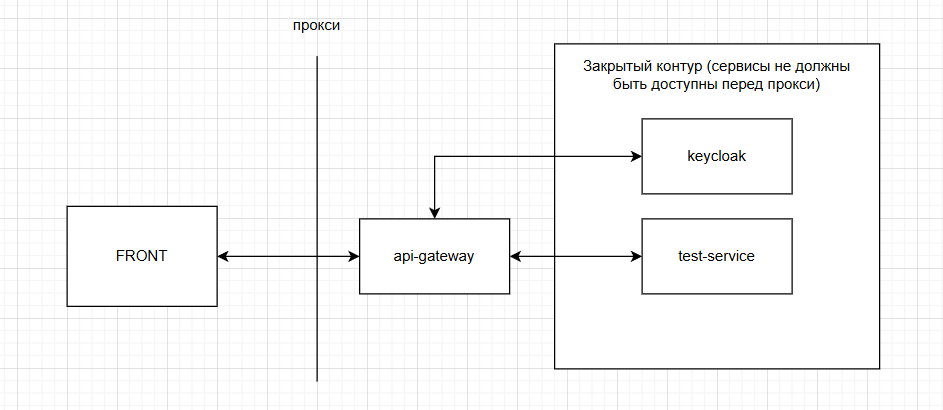
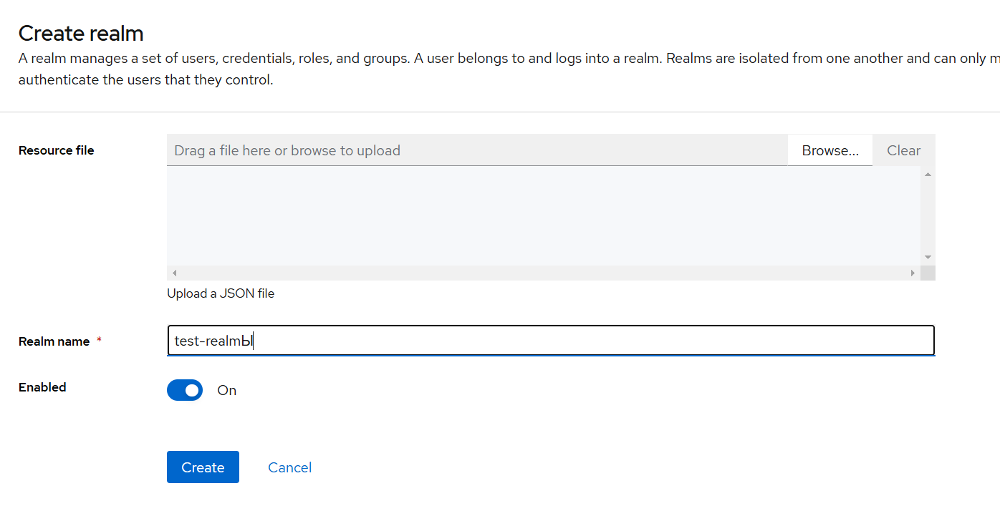
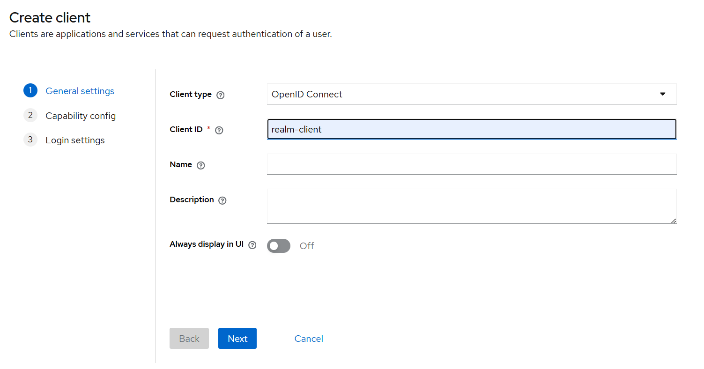
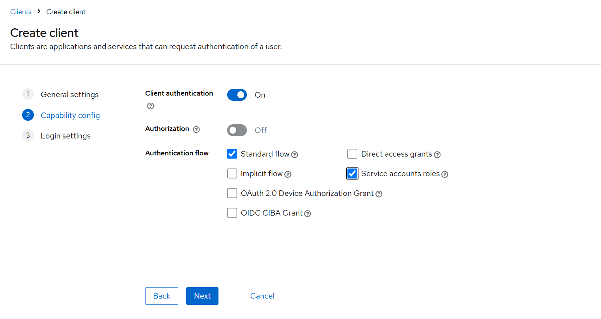
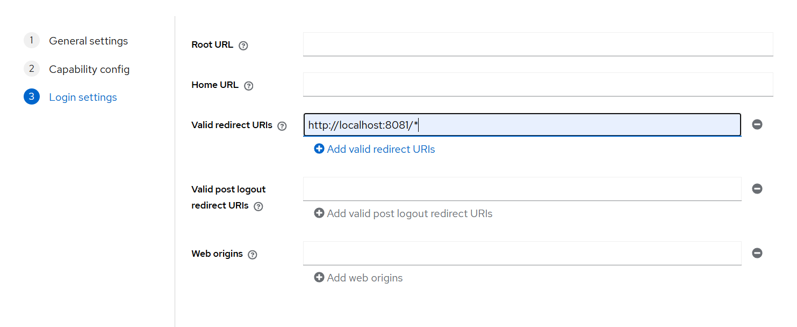

# Пример использования Cloud Gateway MVC + Keycloak

Реализация примера для обмена по схеме

В примере не будет фронта и прокси, т.к. пример направлен именно на реализацию бэк части такой системы.

## keycloak

В keycloak должен быть создан отдельный реалм, 
т.к. использование master приведет к тому, что под администратором кейклока можно будет войти в систему.
Это усложняет проверку работоспособности системы под другими пользователями 
(из одного браузера просто будет невозможно находится и в админке кейклока и в разрабатываемой системе)

### Создание реалма

Далее в кейклоке нужно завести клиента, через которого будет осуществляться авторизация пользователей

### Создание клиента

Важно указать валидный шаблон урлов для редиректа (по сути должен состоять из путей развернутой системы, 
в нашем случае это любой путь сервиса api-gateway). 
При использовании прокси должны быть указаны именно проксированные урлы.

## test-service

## api-gateway

## Использованные в работе ресурсы

- https://habr.com/ru/articles/872856/
- https://spring.io/blog/2019/08/16/securing-services-with-spring-cloud-gateway
